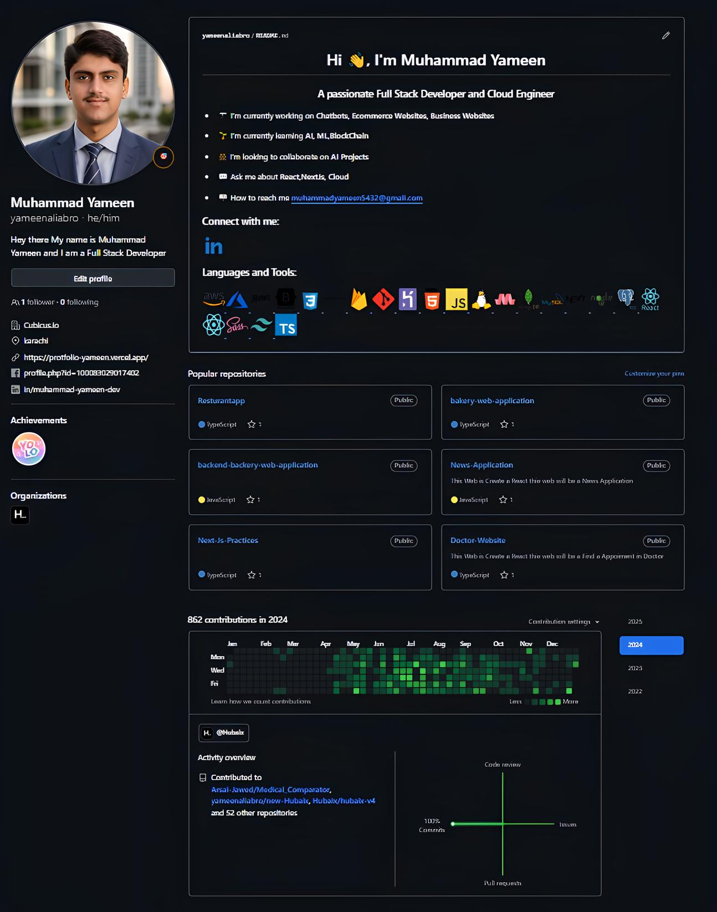
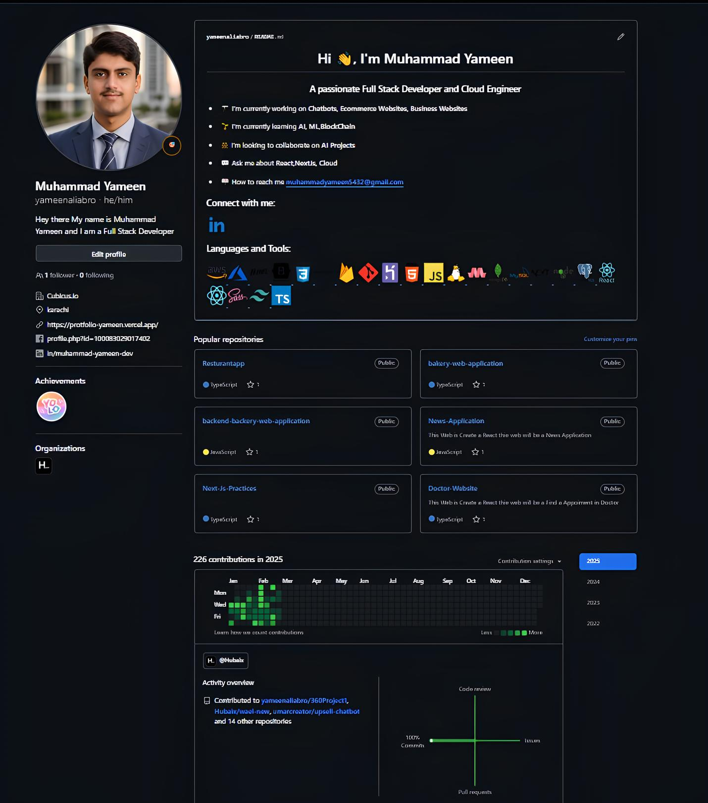

# 🚀 My GitHub Activity

Welcome to my **GitHub Activity Repository**! This repository showcases my GitHub stats, commit streaks, and contributions dynamically.

## 📊 GitHub Stats


## 🔥 Streak Stats


## 📌 Top Languages


## 📈 Activity Graph


---

### 📸 My GitHub Activity Snapshots

Here are some images related to my GitHub contributions:

- 
- 

---

### 📌 How to Use

1. **Fork this repository** or clone it:
   ```sh
   git clone https://github.com/yameenaliabro/My_Github_Activity.git
   ```
